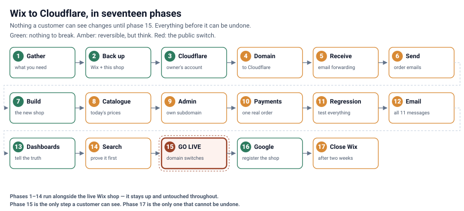

# Salty Lamps — Migration runbook (Wix → Cloudflare + Stripe)

Taking Salty Lamps live: moving off Wix onto the owner's own Cloudflare, Stripe and Resend
accounts, in the order it has to happen.

> This page mirrors the in-admin **Documentation → Migration** page
> (`src/admin/docs/MigrationDoc.jsx`), which is the version to actually work from — it has
> copy-to-clipboard commands and remembers which steps you have completed. Both render the same
> diagram from [`diagrams/`](diagrams/). **When you change one, change the other.**



> ⚠️ **The golden rule:** keep the Wix shop **live and untouched** until the new site is fully
> tested on the real domain. Migration is copy-then-switch, never move-and-hope.

**The order is the design.** Nothing customer-facing changes until Phase 15, and every phase before
it is provable before the next depends on it. Three things sit where they do for reasons worth
knowing:

- **The backup is Phase 2, not Phase 17.** It used to be last — after the domain had moved and the
  Wix subscription had been cancelled, which is the hardest moment to take an export and the worst
  moment to need one.
- **Proving the shop has four phases of its own** (11–14). "The products look right" plus one test
  order was the whole of the verification; regression, email, dashboards and search each fail in a
  way the others would not reveal.
- **The catalogue is loaded twice.** Phase 7 seeds a working shop; Phase 8 replaces it with a Wix
  export taken on the day, so the shop opens with today's prices rather than a months-old snapshot.

---

## Before you start

| Question | Why it matters |
|---|---|
| Who is the **new owner**? (name, email, business and bank details) | Stripe will not complete without all three |
| Where is the domain **registered**? | `saltylamps.co.uk` is at **123-Reg**; Wix only supplies the nameservers, so the switch happens in the 123-Reg panel and needs nothing from Wix |
| Is there **email on the domain**? | Yes — a Zoho mailbox. Its MX records are the single most commonly broken thing in a migration |
| Do you have the **Wix login as account owner**? | A contributor cannot export the order list |

---

## Phase 1 — Gather what you need

Owner's details, the 123-Reg login, the Wix login, the mailbox that shop email should forward to,
and a check that prices and stock in the admin are what you want to go live with. Nothing changes.

## Phase 2 — Back up everything, before touching anything

Wix holds the only copy of the order history and the customer list. Once the domain moves and the
subscription lapses, getting them out ranges from awkward to impossible.

| What | Where |
|---|---|
| Products | Wix → Products → select all → **More Actions → Export**. Max 5,000 rows per file — take every file |
| Orders, **both shapes** | Wix → Orders → select all → **Export**, once as *Orders* (row per order) and once as *Item purchased* (row per line). Times are UTC |
| Contacts | Wix → Contacts → select all → Export |
| Media at full size | Wix → Media → select all → download |
| The two blog posts | No equivalent exists on the new site; Phase 15 redirects the addresses, not the writing |
| The live URL inventory | `node scripts/backup-wix.mjs` |
| The new shop's own data | `./scripts/backup-cloudflare.sh` — D1 export plus the R2 image bucket, with row counts read back |

`scripts/backup-wix.mjs` crawls the live sitemap and records every indexed address with its title
and description. That list is what Phase 14 checks the redirects against — a product added since
the last inventory has an address nobody has thought about, and it becomes a dead link on cutover
day. Output goes to `backups/wix/<date>/` (gitignored).

## Phase 3 — Open the owner's Cloudflare account

Sign up as the owner, enable **R2** (a one-time account opt-in; without it every bucket create
fails with error `10042`), note the Account ID, and create one API token with exactly
`Cloudflare Pages: Edit`, `D1: Edit`, `Workers R2 Storage: Edit`. Store it in the macOS Keychain —
`security add-generic-password -U -a "$USER" -s saltylamps_prod_cloudflare_token -w`.

## Phase 4 — Move the domain to Cloudflare

The Wix site and the Zoho mailbox must never go dark, and every step before the last is reversible
by putting the old nameservers back.

1. **Record everything first**, including `dig +short DS saltylamps.co.uk` —
   **any output there means DNSSEC is on, and changing nameservers with it on takes the domain
   completely offline**, website and email, for everyone. Turn it off at 123-Reg and wait for it to
   clear before going further. This is the single most destructive thing on this page.
2. **Lower the TTL** at 123-Reg a day ahead. It is what makes an undo take minutes rather than a day.
3. **Add the zone** in Cloudflare ([onboard a domain](https://developers.cloudflare.com/fundamentals/manage-domains/add-site/)),
   free plan. Write down the two nameservers it assigns **and** keep the old Wix pair next to them.
4. **Check the imported records by hand** — especially the three `zoho.eu` MX rows and their
   priorities. A scan is not a guarantee.
5. **Point the old shop at Wix the supported way**: `A` at the apex → `185.230.63.107`,
   `CNAME www` → `pointing.wixdns.net`, both **DNS only** (grey cloud).
6. **Change the nameservers at 123-Reg** to Cloudflare's two, **and only those** — a leftover
   nameserver leaves the zone on "Pending Nameserver Update" indefinitely.
7. **Verify** the old shop still loads and mail still arrives before continuing.

> **On `.co.uk`:** this is a nameserver change, not a transfer — the registration stays at 123-Reg.
> If the registration is ever moved, note that `.uk` domains do not use the auth codes `.com` uses;
> they move by an **IPS tag** change at Nominet, pushed by the losing registrar.

## Phase 5 — Take over the shop's email (receiving)

Cloudflare **Email → Email Routing**: onboard the domain, add and **confirm** a destination address,
add a rule per address plus a catch-all, then prove it by sending from an outside account.
Export the old mailbox's archive — but do not cancel it until Phase 17.

> Email Routing **forwards**; it does not host a mailbox. Sending *as* `info@saltylamps.co.uk` needs
> a "send as" configuration in the destination mailbox.

## Phase 6 — Let the shop send (Resend)

Add `saltylamps.co.uk` to Resend, region **Ireland (`eu-west-1`)** — immutable after creation.
Resend places its records on the **`send.` subdomain**, which it creates itself.

> **The SPF question, settled.** The shop's SPF and DKIM go on `send.saltylamps.co.uk`; the
> mailbox provider's SPF goes on the plain domain. **They are separate records and neither
> replaces the other.** Earlier notes in this repo said the root record had to authorise Zoho and
> Resend together — that describes a root-domain sending setup, not this one, and merging them
> would break the mailbox's own authentication. Verify the exact names in the Resend dashboard
> rather than assuming; Resend can place records at the root depending on how the domain was added.
>
> Separately: the domain has **no SPF record at all** today, so mailbox mail is unauthenticated.
> Not something this migration breaks, but the natural moment to fix it.

Leave **Send transactional email** off until Phase 12.

## Phase 7 — Build the new shop

`./deploy-production.sh` with the owner's token. It runs in two passes: the first creates the D1
database and stops with an id to paste into `wrangler.prod.toml`; the second, with `SEED_CATALOG=1`,
loads the catalogue and deploys. Reseeding is refused once orders exist. Then confirm no demo data
reached production — `orders`, `order_items`, `email_outbox` and `enquiries` must all be empty.

## Phase 8 — Load today's real catalogue from the Wix backup

```
node scripts/catalogue-reset.mjs import-wix --csv=~/Downloads/catalog_products.csv
node scripts/catalogue-reset.mjs plan  --api=https://salty-lamps.pages.dev
node scripts/catalogue-reset.mjs apply --api=https://salty-lamps.pages.dev
```

Wix wins on **name, price, stock, track mode, visibility**. The new site keeps its
**descriptions, images, categories and slugs** — those were prepared for this shop and do not exist
in Wix. Nothing is ever deleted: a product missing from an export is reported, because a filtered
export is indistinguishable from a discontinued line and only one of those is recoverable. Every
write goes through the admin API, so it all lands in `admin_audit` and no `skus.id` is recreated
(see `infra/known-issues.md` §1).

New products arrive with **no image** — Wix's images are on Wix's CDN. The import flags them.

> Run this **before** Phase 9. Afterwards the admin sits behind Cloudflare Access and the tool needs
> an Access **service token** (`CF_ACCESS_CLIENT_ID` / `CF_ACCESS_CLIENT_SECRET`); it says so if you
> hit it.

## Phase 9 — Move the admin to its own subdomain, and lock it

The admin stops being a page on the shop and becomes `admin.saltylamps.co.uk`.

1. Add the custom domain to the same Pages project.
2. Create a **self-hosted Access application** over the whole hostname —
   [Zero Trust → Access controls → Applications](https://developers.cloudflare.com/cloudflare-one/access-controls/applications/http-apps/self-hosted-public-app/).
3. Policy: *Allow*, rule *Emails*, **named addresses only**.
4. Set `ACCESS_AUD`, `ACCESS_TEAM_DOMAIN` and `ADMIN_HOSTS` as Pages secrets, then **redeploy** —
   secrets bind at deploy time.
5. Prove both directions: `/admin` and `/api/admin/*` must be **absent** from the shop's hostname,
   and the admin hostname must ask for a sign-in.
6. `ADMIN_OPEN_HOSTS` must not exist on this project. It opens the admin with no sign-in at all.

> **`ADMIN_HOSTS` unset means the admin is served everywhere, exactly as before this existed.**
> That is deliberate: the code can ship ahead of the cutover without changing any behaviour. The
> rollback for a lockout is to remove the secret and redeploy.

## Phase 10 — Payments

Stripe account **registered in the United Kingdom** — fixed at creation, and a non-UK account
cannot offer PayPal at all and converts every sale. Create a **live** key, switch **Google Pay** on
(off by default), and add a webhook in **Workbench → Webhooks** (Stripe has replaced the old
Developers page) for `checkout.session.completed` only. Set `STRIPE_SECRET_KEY`,
`STRIPE_WEBHOOK_SECRET`, `RESEND_API_KEY`, `SITE_URL`, then redeploy. Place one real low-value
order and keep it — Phases 12 and 13 check against it.

> **On the endpoint's API version.** Stripe serialises at the version pinned on the *endpoint*. The
> delivery address moved: up to `2024-06-20` it is `session.shipping_details`, from 2025 it is
> `session.collected_information.shipping_details`. `functions/api/webhook.js` reads both. Do not
> "simplify" that to one path — reading only the old one silently falls back to the *billing*
> address.

## Phase 11 — Regression test

```
cd tests && npm install && npx playwright install chromium
E2E_BASE_URL=https://salty-lamps.pages.dev E2E_ADMIN_HOST=https://admin.saltylamps.co.uk npx playwright test
```

Storefront, basket, post-payment pages, contact forms, every admin screen, the sitemaps and
redirects, and the admin host split in both directions. Then the things a machine cannot judge: the
site on a real phone, no empty categories, an order taken through packed → shipped → delivered, a
product edited and reverted, stock actually decrementing.

`tests/` is **its own npm package on purpose** — `@playwright/test` in the site's devDependencies
would run a browser download on every Cloudflare Pages build.

## Phase 12 — Prove every email

All eleven templates, each against its real trigger: order confirmation and the admin alert
(webhook), shipped with a tracking URL, delivered, refunded, cancelled (admin transitions — they
fire only on a genuine change), low stock (**on the crossing only**), the three enquiry forms, the
customer refund request (rate-limited to one per order per hour), and a re-send from the outbox.

`skipped` in Emails → Activity is **not** a failure — it means the send was deliberately
suppressed. There is **no automatic retry**; the outbox re-send is the only recovery.

Finally, open one customer email in Gmail → *Show original* and confirm **SPF, DKIM and DMARC all
pass**. If not, Phase 6 is not finished and every confirmation is going to spam.

## Phase 13 — Check the dashboards

Every figure is counted from real orders; none is decorative. Confirm no demo data, find the test
order in Orders, and confirm it moved revenue today/week/month, Recent orders, the fulfilment
funnel, the 14-day chart and Top products. Download all three CSV exports.

> On day one the dashboard is nearly empty. That is correct, not broken.
>
> The shop's day runs on **Europe/London**, not UTC — see `functions/lib/shop-time.mjs`. Before
> that existed, an order placed at 00:30 BST was counted against the previous day.

## Phase 14 — Prove the SEO before anyone can see it

The Wix sitemap listed **54 indexed URLs** and only 17 exist unchanged here, because this shop
publishes a page per **variant** where Wix published one per **product**. `public/_redirects`
carries rules for the rest.

```
npm run build
node scripts/backup-wix.mjs --no-images --compare-redirects
```

Then: [Rich Results Test](https://search.google.com/test/rich-results) on a product page (Product
with price, availability and breadcrumbs, no errors), [PageSpeed Insights](https://pagespeed.web.dev/)
on **mobile** (LCP under 2.5 s, INP under 200 ms, CLS under 0.1), and confirm the `.pages.dev` and
admin hostnames serve `Disallow: /` while the real shop does not.

> **The apex redirect in `_redirects` does not work and never has.** Cloudflare skips absolute URLs
> in that file — `wrangler` reports *"Only relative URLs are allowed"* at line 23 on every build.
> A whole-domain redirect needs a zone-level **Redirect Rule**, because `_redirects` is only
> consulted once a request has already arrived at the right hostname.

## Phase 15 — Go live

Add `www.saltylamps.co.uk` and the apex as custom domains, update `SITE_URL`, **edit** the existing
Stripe webhook (editing keeps the signing secret; a new endpoint issues a new one), redeploy, then
re-run the whole Phase 11 suite against the real address and place one more real order.

## Phase 16 — Tell Google

Search Console **Domain** property (covers www/apex and both protocols) verified by a TXT record —
**leave it in place**. Submit `sitemap.xml`. Repeat at Bing Webmaster Tools. Claim the Google
Business Profile for the Stoke-on-Trent address.

## Phase 17 — Close down Wix

Only after a fortnight. Check the Phase 2 backup is complete, watch Search Console and the Orders
list, disconnect the domain from the Wix site, then cancel Wix and the old mailbox.

---

## Rolling back

| Went wrong at | Undo | Back to normal in |
|---|---|---|
| Phase 4 (domain) | Put the original Wix nameservers back at 123-Reg | Under an hour with a lowered TTL; up to a day without |
| Phase 5 (email in) | Turn Email Routing off — the old mailbox was never touched | Minutes |
| Phase 6 (email out) | Delete and re-add the domain in Resend; a half-verified entry confuses the next attempt | No customer impact |
| Phase 8 (catalogue) | Restore the previous `data/catalogue.json` and apply again; nothing was deleted | Minutes |
| Phase 9 (admin) | Remove `ADMIN_HOSTS` and redeploy — the admin returns to the shop's address | One deploy |
| Phase 15 (live) | Point `www` back at `pointing.wixdns.net` and the apex at Wix; the Wix site is still paid for until Phase 17 | Minutes — the domain is already on Cloudflare |

Every row assumes Phase 2 was done. It is the only phase with no undo of its own, which is why it
comes second.
