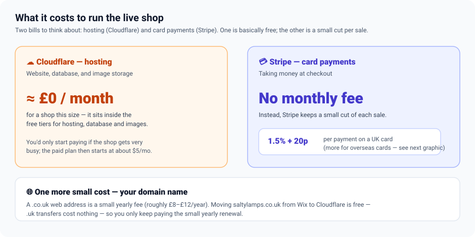
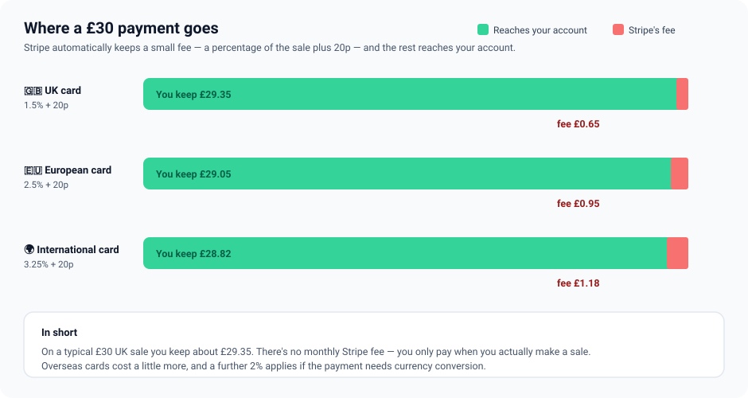

# Salty Lamps — Pricing (plain-English)

What does it actually cost to run the Salty Lamps shop once it's live? In short: hosting is effectively free for a shop this size, and you pay a small fee only when you make a sale.

> This page mirrors the in-admin **Documentation → Pricing** page. Both render the same diagrams from [`diagrams/`](diagrams/).

> **The bottom line:** **Cloudflare** (the website, database and image storage) costs roughly **£0/month** at this scale. **Stripe** has **no monthly fee** — it simply keeps a small cut of each payment (about **1.5% + 20p** on a UK card). So your running cost is essentially "a little bit per sale."

## The two bills

There are only two things to pay for to keep the shop running, plus a small yearly cost for the domain name.

## How Stripe's fee works

Stripe takes its fee automatically out of each payment — a percentage of the sale plus a fixed 20p — and sends the rest to your bank account. The percentage depends on where the customer's card is from.

| Customer's card | Stripe fee | On a £30 sale, you keep |
|---|---|---|
| UK card | 1.5% + 20p | £29.35 |
| European (EEA) card | 2.5% + 20p | £29.05 |
| International card | 3.25% + 20p | £28.82 |

> **One extra to know about:** if a payment needs **currency conversion**, Stripe adds a further **2%**. Most UK sales won't hit this.

## Cloudflare: free for a shop this size

Everything Cloudflare provides for the shop sits comfortably inside its free allowances, so there's normally nothing to pay:

- **Website hosting & the behind-the-scenes functions** — free up to 100,000 visits' worth of requests per day.
- **The database** (products, stock, orders) — free up to millions of reads a day and 5 GB of data.
- **Image storage** — free up to 10 GB (a shop's photos are a fraction of that).
- **Admin sign-in security** (Cloudflare Access) — free for a small team.

You'd only ever pay Cloudflare if the shop became very busy and outgrew those free limits — at which point the paid plan starts at about **$5/month**. For a growing small shop, that's a long way off.

## A simple monthly picture

| What | When you pay | Rough cost |
|---|---|---|
| Cloudflare (hosting, database, images, admin security) | Monthly | ≈ £0 at this scale |
| Stripe (card payments) | Per sale | ~1.5% + 20p per UK sale |
| Domain name (e.g. saltylamps.co.uk) | Yearly | A few pounds a year |

## Buying or moving the domain

The shop already owns **saltylamps.co.uk** (currently registered at Wix). Two things to know about the cost:

- **Moving it to Cloudflare is free.** `.co.uk` (and other `.uk`) domains have **no transfer fee** and moving them doesn't add a year — so shifting the domain from Wix to Cloudflare costs **£0**. You simply keep paying the normal yearly renewal.
- **The yearly renewal is small** — a `.co.uk` is typically a few pounds a year (roughly **£8–£12/year**; Cloudflare charges at cost, with no markup).
- If you ever register a brand-new domain instead of moving this one, it's the same kind of small yearly fee.

> The step-by-step for moving the domain (and everything else) is in the **Migration** page of this Documentation section.

> ⚠️ **Prices can change — always check the official pages.** The figures here were accurate when written but providers update their pricing. Confirm current rates: [Stripe UK pricing](https://stripe.com/gb/pricing), [Cloudflare Workers/Pages](https://developers.cloudflare.com/workers/platform/pricing/), [Cloudflare D1](https://developers.cloudflare.com/d1/platform/pricing/), and [Cloudflare R2](https://developers.cloudflare.com/r2/pricing/).
