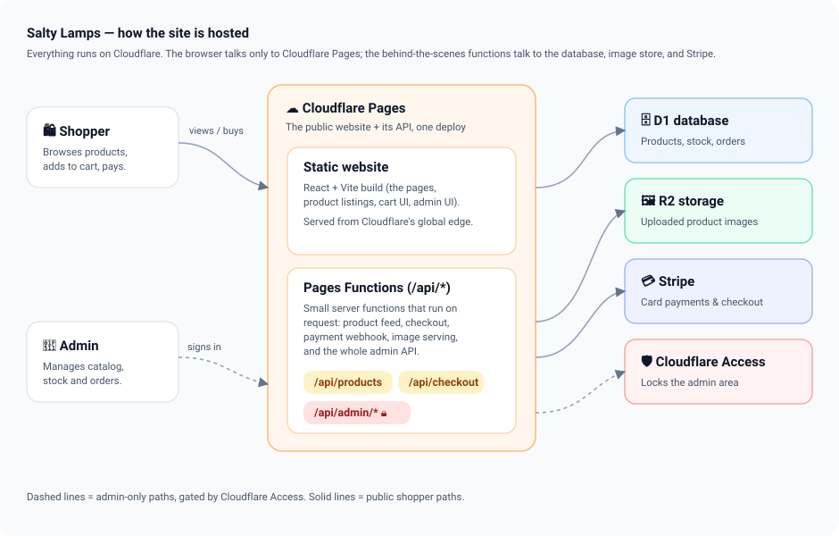
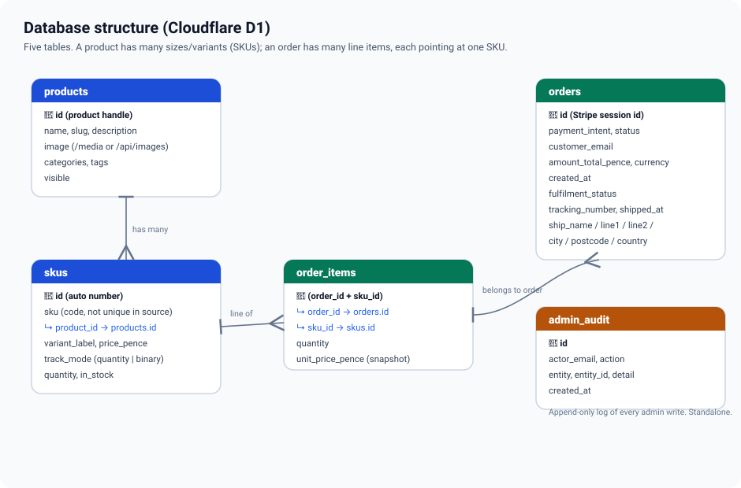
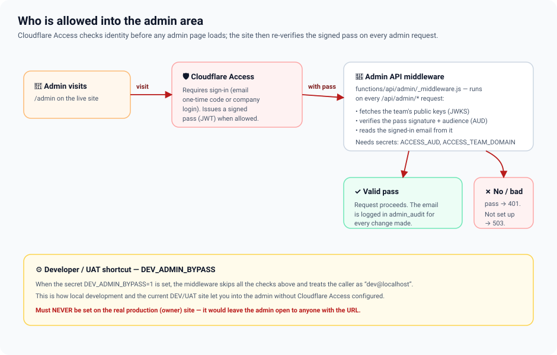
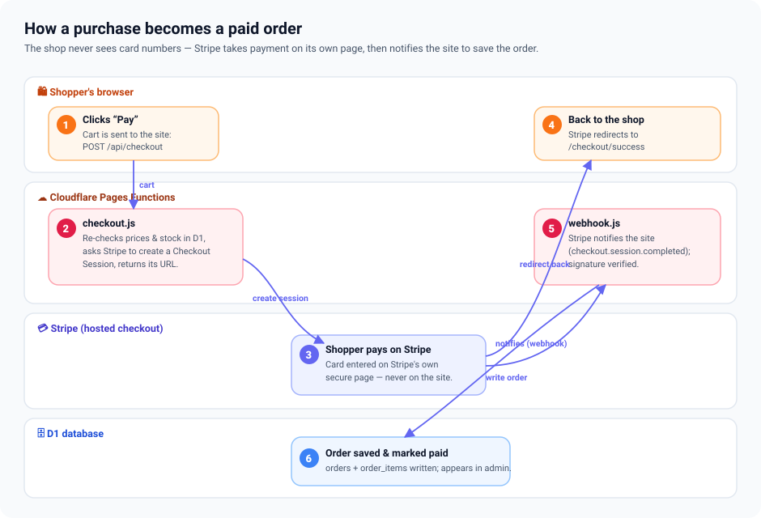

# Salty Lamps — Technical Documentation

A complete engineering reference for the application: stack, architecture, data model, API surface, auth, build/deploy, and a guide to common changes. Everything here reflects the current code.

> This page mirrors the in-admin **Documentation → Technical Doc** page. Both render the same diagrams from [`diagrams/`](diagrams/).

## 1. Overview & tech stack

Salty Lamps is a single React application serving both the public storefront and the admin portal, deployed to **Cloudflare Pages**. The backend is a set of Cloudflare **Pages Functions** (file-based routes under `functions/api/`), backed by **D1** (SQLite), **R2** (uploaded images), and **Stripe Checkout** (payments). Admin routes are gated by Cloudflare Access.

| Layer | Technology | Notes |
|---|---|---|
| UI | React 18, Vite 5 | One SPA; storefront + admin in the same bundle |
| Routing | Hand-rolled `history.pushState` | No router library; string-parses `location.pathname` |
| Styling | Hand-written CSS + design tokens | Tailwind configured but unused (see §4) |
| Hosting / API | Cloudflare Pages + Pages Functions | File-path = route under `functions/api/` |
| Database | Cloudflare D1 (SQLite) | Binding `DB` |
| Object storage | Cloudflare R2 | Binding `IMAGES`; admin-uploaded photos |
| Payments | Stripe Checkout + webhook | Server-side only; no card data touches the app |
| Admin auth | Cloudflare Access (Zero Trust) | RS256 JWT verified in middleware |
| Peripheral | Supabase | Optional enquiry/notes persistence only — not shop data |

## 2. Repository layout

```
salty-lamps-site/
├─ index.html                 SPA entry
├─ vite.config.js             build + /api dev proxy → wrangler (port 8788)
├─ wrangler.toml              Pages config: D1 (DB) + R2 (IMAGES) bindings
├─ src/
│  ├─ main.jsx                mounts <App>, imports the two stylesheets
│  ├─ App.jsx                 storefront SPA (routing + all shopper views)
│  ├─ admin/
│  │  ├─ AdminApp.jsx         admin SPA (dashboard, orders, catalog, inventory, reports, docs)
│  │  └─ docs/                the in-admin documentation pages
│  ├─ components/             DonutChart (live); the rest is an older proposal deck (unused)
│  ├─ lib/supabase.js         optional Supabase client
│  └─ styles/                 saltylamps.css (storefront) + admin.css (portal)
├─ functions/
│  ├─ api/                    Pages Functions (public + admin endpoints)
│  └─ lib/                    flatten-products, admin-helpers, validation (shared)
├─ d1/                        schema.sql, migrations/, seed.sql, demo/reset SQL
├─ docs/                      these docs as Markdown + diagrams/*.svg (single source)
└─ scripts/                   generate-seo.mjs, uat-refresh.sh, deploy helpers
```

## 3. Runtime architecture



## 4. Frontend

**Routing.** No router library. `App.jsx` reads `window.location.pathname`, holds it in state, listens for `popstate`; navigation calls `history.pushState` and dispatches a synthetic `popstate`. The route string is parsed into a view via string matching. When the path starts with `/admin`, `App.jsx` returns `<AdminApp route={route} />` early, and `AdminApp` repeats the scheme for its own sub-routes.

| Route | View |
|---|---|
| `/` | Home |
| `/shop`, `/category/:slug`, `/collection/:slug` | Shop listing |
| `/product-page/:slug` | Product detail |
| `/checkout/success`, `/checkout/cancelled` | Post-payment pages |
| `/gallery`, `/reviews`, `/process`, policy pages | Static content |
| `/admin/*` | Admin SPA (§6) |

**Data.** The storefront fetches `GET /api/products` and starts payment with `POST /api/checkout` (body `{ items: [{ skuId, quantity }] }` — no client-supplied prices). The only shared component still wired in is `DonutChart.jsx` (used by the admin dashboard).

> ⚠️ **Styling reality (verify before assuming):** styling is **hand-written CSS** in `src/styles/saltylamps.css` and `admin.css`, built on a shared CSS-custom-property design-token system. **Tailwind is configured but not actually used** (no `@tailwind` directives), and **Bootstrap is a dependency imported nowhere** — both are effectively dead and safe to remove. The `src/components/views/*` "proposal deck" subtree is also orphaned.

## 5. Backend — API surface

Pages Functions; the file path is the route. Handlers export `onRequestGet/Post/Patch/Delete`.

### Public endpoints

| Route | Method | Purpose |
|---|---|---|
| `/api/products` | GET | Flattened visible catalogue (one card per SKU); 60s cache |
| `/api/checkout` | POST | Re-verifies price/stock in D1, creates a Stripe Checkout Session, returns its URL |
| `/api/webhook` | POST | Stripe webhook; on `checkout.session.completed` writes the order and decrements stock (idempotent) |
| `/api/images/*` | GET | Serves R2-stored uploaded images; 1-year immutable cache, ETag |

### Admin endpoints (all behind `_middleware.js`)

| Route | Methods | Purpose |
|---|---|---|
| `/api/admin/stats` | GET | Dashboard batch: revenue, counts, stock alerts, 14-day series, comparisons |
| `/api/admin/orders` | GET | Filter/paginate orders with item counts |
| `/api/admin/orders/:id` | GET, PATCH | Order detail; update fulfilment/tracking, or refund/cancel (real Stripe refund) |
| `/api/admin/orders/by-month`, `/by-year` | GET | Paid orders grouped by period |
| `/api/admin/products` | GET, POST | List all (incl. hidden) with SKUs; create product + ≥1 SKU |
| `/api/admin/products/:id` | PATCH, DELETE | Update; delete (blocked if a SKU appears on orders) |
| `/api/admin/products/:id/skus` | POST | Add a SKU/variant |
| `/api/admin/products/:id/image` | POST | Upload image (type-sniffed, ≤2 MB) to R2, update `products.image` |
| `/api/admin/skus/:id` | PATCH, DELETE | Update; delete (blocked if on orders or the last SKU) |
| `/api/admin/inventory` | PATCH | Bulk stock update (≤500 lines), validated per SKU track mode |
| `/api/admin/reports/sales` | GET | Daily paid series + totals; `?format=csv` |
| `/api/admin/reports/top-products` | GET | Best sellers + revenue by category; CSV |
| `/api/admin/reports/inventory-valuation` | GET | Stock-on-hand value, low/out-of-stock; CSV |

## 6. Admin SPA

`AdminApp.jsx` renders the sidebar shell and dispatches to page components: `Dashboard`, `OrdersList`/`OrderDetail`, `ProductsList`/`ProductEdit`, `Inventory`, `Reports`, `Settings`, and the `docs` pages. Shared helpers: `Icon` (inline-SVG set), `AdminLink`/`navigate` (pushState), `usePageData` (fetch hook), and `api()` (fetch wrapper with structured errors). Admin forms import the same `validation.mjs` the server uses, so client and server rules never diverge.

## 7. Shared modules (`functions/lib/`)

- **flatten-products.mjs** — the products+SKUs query and row-flattener, shared by `api/products.js` and the build-time SEO generator.
- **admin-helpers.mjs** — response helpers (`json`, `apiError`), the audit-log insert, CSV helpers, day-series zero-fill.
- **validation.mjs** — single source of truth for input rules and money conversion; imported by both the Functions and the admin UI.

## 8. Data model



- **products** → has many **skus** (`skus.product_id`).
- **orders** → has many **order_items** (`order_items.order_id`); each item references one **sku** (`order_items.sku_id`) and snapshots its price.
- **admin_audit** — append-only log of every admin write (actor email + action).

> ⚠️ **Two schema gotchas:** `skus.sku` is deliberately **not unique** (the source catalogue reuses codes), so `order_items` references the surrogate `skus.id`. And **D1 does not enforce foreign keys**, which is why deletes are guarded in code.

## 9. Authentication



`functions/api/admin/_middleware.js` runs on every `/api/admin/*` request. It reads the Access JWT (`Cf-Access-Jwt-Assertion` header or `CF_Authorization` cookie), requires **RS256**, fetches and caches the team **JWKS**, verifies the signature, issuer, expiry, and **audience** (`ACCESS_AUD`), then exposes the caller's email for audit logging. It **fails closed**: if `ACCESS_AUD` or `ACCESS_TEAM_DOMAIN` is missing it returns 503.

> ⚠️ **DEV_ADMIN_BYPASS:** if the secret `DEV_ADMIN_BYPASS=1` is set, the middleware skips all checks and treats the caller as `dev@localhost`. For local dev and the DEV/UAT site only — **never set it in production**.

## 10. Checkout & payments



`checkout.js` re-checks every line against D1 (price + stock) before creating the Stripe Checkout Session — the client never supplies prices. `webhook.js` verifies the Stripe signature and, on `checkout.session.completed`, writes `orders` + `order_items` and decrements quantity-tracked stock, idempotently.

## 11. Build & deploy pipeline

- **Dev:** `vite` serves the SPA and proxies `/api` to a local `wrangler pages dev` (port 8788). Run both for full-stack local testing.
- **Build:** `npm run build` = `vite build` then `scripts/generate-seo.mjs`, which prerenders per-route HTML shells (title/description/canonical/OG/JSON-LD), plus `robots.txt` and sitemaps. `/admin/*` is excluded from prerender and sitemaps.
- **Deploy (dev/UAT):** `./deploy-cloudflare.sh` → `wrangler pages deploy dist` to the `salty-lamps-proposal` project (hotmail account).
- **Deploy (production):** `./deploy-production.sh` — account-agnostic; provisions D1 + R2 on the owner's own account, catalog-only seed, then the owner attaches their own live Stripe keys. See [`PRODUCTION-HANDOVER.md`](../PRODUCTION-HANDOVER.md).

## 12. Environments & secrets

Secrets are set with `wrangler pages secret put` (never committed):

| Secret / var | Used by |
|---|---|
| `STRIPE_SECRET_KEY` | checkout, webhook, refunds |
| `STRIPE_WEBHOOK_SECRET` | webhook signature verification |
| `SITE_URL` | Stripe success/cancel redirects |
| `ACCESS_AUD`, `ACCESS_TEAM_DOMAIN` | admin auth middleware |
| `DEV_ADMIN_BYPASS` | dev/UAT admin bypass (never in prod) |
| `VITE_SUPABASE_URL`, `VITE_SUPABASE_ANON_KEY` | optional enquiry persistence (build-time, in `.env.local`) |

## 13. How to make common changes

- **Add a product field:** add the column in `d1/schema.sql` + a migration; update `validation.mjs`, the admin `products` endpoints, and `ProductEdit`.
- **Add an admin page:** add a component in `AdminApp.jsx`, an entry to `NAV`/`TITLES`, and a branch in the route dispatch (this docs section is a worked example).
- **Add an API endpoint:** create a file under `functions/api/` (public) or `functions/api/admin/` (auto-authed); export the right `onRequest*` handler.
- **Change validation:** edit `functions/lib/validation.mjs` once — both server and admin UI pick it up.
- **Reseed the catalogue:** regenerate `d1/seed.sql` via `scripts/generate-d1-seed.mjs` (see the footgun below).

## 14. Known issues & tech debt

- **Catalogue seed is destructive:** `d1/seed.sql` deletes+reinserts products/skus; because `skus.id` is autoincrement, re-running it after real orders exist orphans `order_items`. Switch to an UPSERT on `(product_id, sku)` before heavy production use.
- **Dead dependencies:** `bootstrap` is unused; `tailwindcss` is configured but produces no CSS for the live app. Removable.
- **Orphaned subtree:** `src/components/views/*` (the old proposal deck) is not part of the shipped app.
- **Package name** is still `salty-lamps-proposal`; harmless but worth renaming for production.
