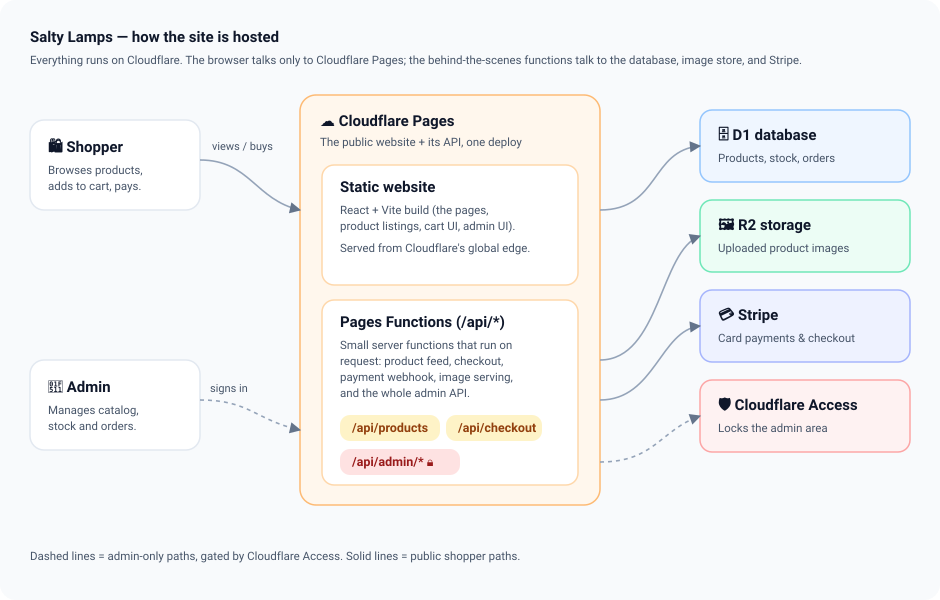
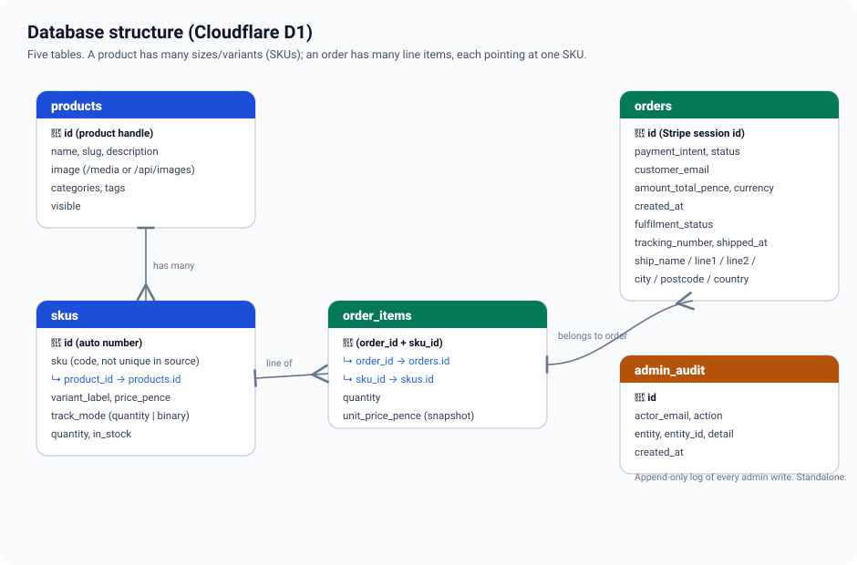
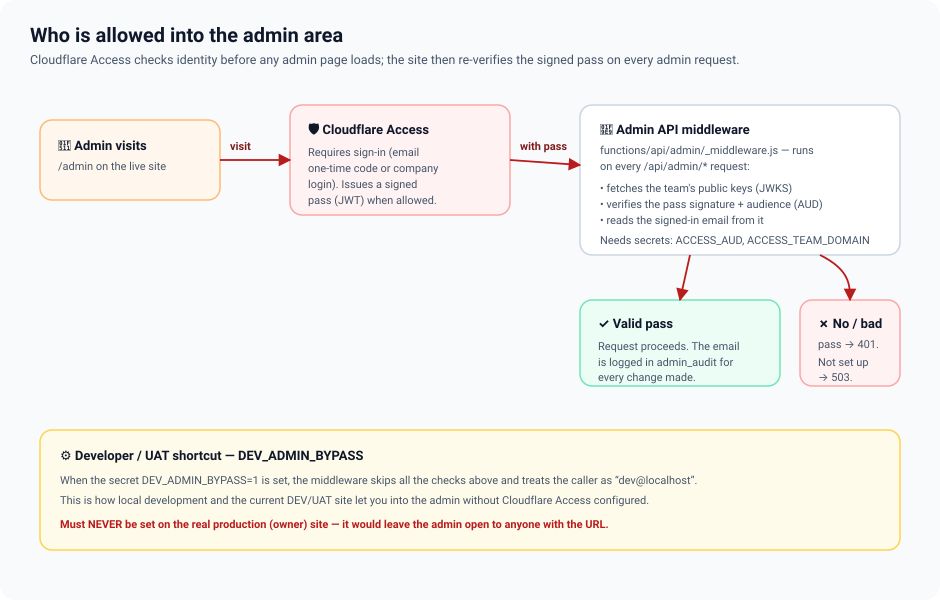
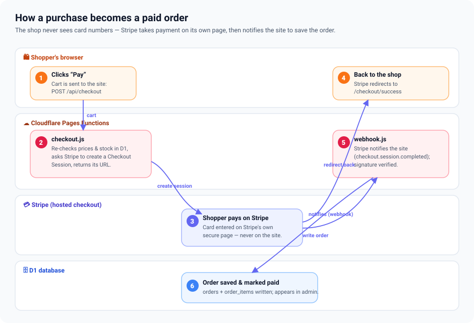

# Salty Lamps — Technical Documentation

A complete engineering reference for the application: stack, architecture, data model, API surface, auth, build/deploy, and a guide to common changes. Everything here reflects the current code.

> This page mirrors the in-admin **Documentation → Technical Doc** page. Both render the same diagrams from [`diagrams/`](diagrams/).

## 1. Overview & tech stack

Salty Lamps is a single React application serving both the public storefront and the admin portal, deployed to **Cloudflare Pages**. The backend is a set of Cloudflare **Pages Functions** (file-based routes under `functions/api/`), backed by **D1** (SQLite), **R2** (uploaded images), and **Stripe Checkout** (payments). Admin routes are gated by Cloudflare Access.

| Layer | Technology | Notes |
|---|---|---|
| UI | React 18, Vite 6 | One SPA; owner interface loaded on demand |
| Routing | Hand-rolled `history.pushState` | No router library; string-parses `location.pathname` |
| Styling | Hand-written CSS + design tokens | Tailwind configured but unused (see §4) |
| Hosting / API | Cloudflare Pages + Pages Functions | File-path = route under `functions/api/` |
| Database | Cloudflare D1 (SQLite) | Binding `DB` |
| Object storage | Cloudflare R2 | Binding `IMAGES`; admin-uploaded photos |
| Payments | Stripe Checkout + webhook | Server-side only; no card data touches the app |
| Admin auth | Cloudflare Access (Zero Trust) | RS256 JWT verified in middleware |
| Transactional email | Resend, over HTTP | Order, fulfilment, enquiry and stock notifications |

## 2. Repository layout

```
salty-lamps-site/
├─ index.html                 SPA entry
├─ vite.config.js             build + /api dev proxy → wrangler (port 8788)
├─ wrangler.toml              Pages config: D1 (DB) + R2 (IMAGES) bindings
├─ src/
│  ├─ main.jsx                mounts <App>, imports the two stylesheets
│  ├─ App.jsx                 storefront SPA (routing + all shopper views)
│  ├─ admin/
│  │  ├─ AdminApp.jsx         admin SPA (dashboard, orders, catalog, inventory, reports, docs)
│  │  └─ docs/                the in-admin documentation pages
│  ├─ components/             DonutChart (live); the rest is an older proposal deck (unused)
│  └─ styles/                 saltylamps.css (storefront) + admin.css (portal)
├─ functions/
│  ├─ api/                    Pages Functions (public + admin endpoints)
│  └─ lib/                    flatten-products, admin-helpers, validation (shared)
├─ d1/                        schema.sql, migrations/, seed.sql, demo/reset SQL
├─ docs/                      these docs as Markdown + diagrams/*.svg (single source)
└─ scripts/                   generate-seo.mjs, uat-refresh.sh, deploy helpers
```

## 3. Runtime architecture



## 4. Frontend

**Routing.** No router library. `App.jsx` reads `window.location.pathname`, holds it in state, listens for `popstate`; navigation calls `history.pushState` and dispatches a synthetic `popstate`. The route string is parsed into a view via string matching. When the path starts with `/admin`, `App.jsx` returns `<AdminApp route={route} />` early, and `AdminApp` repeats the scheme for its own sub-routes.

| Route | View |
|---|---|
| `/` | Home |
| `/shop`, `/category/:slug`, `/collection/:slug` | Shop listing |
| `/product-page/:slug` | Product detail |
| `/checkout` | Editable order review, delivery estimate, and secure payment hand-off |
| `/checkout/success`, `/checkout/cancelled` | Post-payment pages |
| `/gallery`, `/reviews`, `/process`, policy pages | Static content |
| `/admin/*` | Admin SPA (§6) |

**Data.** The storefront fetches `GET /api/products` and starts payment with `POST /api/checkout` (body `{ items: [{ skuId, quantity }] }` — no client-supplied prices). Cart option, quantity and delivery controls are shared by the drawer and order review.

> ⚠️ **Styling reality (verify before assuming):** styling is **hand-written CSS** in `src/styles/saltylamps.css` and `admin.css`, built on a shared CSS-custom-property design-token system. **Tailwind is configured but not actually used** (no `@tailwind` directives), and **Bootstrap is a dependency imported nowhere** — both are effectively dead and safe to remove. The `src/components/views/*` "proposal deck" subtree was confirmed orphaned and has been removed.

## 5. Backend — API surface

Pages Functions; the file path is the route. Handlers export `onRequestGet/Post/Patch/Delete`.

### Public endpoints

| Route | Method | Purpose |
|---|---|---|
| `/api/products` | GET | Flattened visible catalogue (one card per SKU); 60s cache |
| `/api/checkout` | POST | Re-verifies price/stock in D1, creates a Stripe Checkout Session, returns its URL |
| `/api/webhook` | POST | Stripe webhook; on `checkout.session.completed` writes the order and decrements stock (idempotent) |
| `/api/images/*` | GET | Serves R2-stored uploaded images; 1-year immutable cache, ETag |

### Admin endpoints (all behind `_middleware.js`)

| Route | Methods | Purpose |
|---|---|---|
| `/api/admin/stats` | GET | Dashboard batch: revenue, counts, stock alerts, 14-day series, comparisons |
| `/api/admin/orders` | GET | Filter/paginate orders with item counts |
| `/api/admin/orders/:id` | GET, PATCH | Order detail; despatch (carrier + consignment number + tracking link), move fulfilment status, or refund/cancel (real Stripe refund) |
| `/api/admin/orders/by-month`, `/by-year` | GET | Paid orders grouped by period |
| `/api/admin/products` | GET, POST | List all (incl. hidden) with SKUs; create product + ≥1 SKU |
| `/api/admin/products/:id` | PATCH, DELETE | Update; delete (blocked if a SKU appears on orders) |
| `/api/admin/products/:id/skus` | POST | Add a SKU/variant |
| `/api/admin/products/:id/image` | POST | Upload image (type-sniffed, ≤2 MB) to R2, update `products.image` |
| `/api/admin/skus/:id` | PATCH, DELETE | Update; delete (blocked if on orders or the last SKU) |
| `/api/admin/inventory` | PATCH | Bulk stock update (≤500 lines), validated per SKU track mode |
| `/api/admin/reports/sales` | GET | Daily paid series + totals; `?format=csv` |
| `/api/admin/reports/top-products` | GET | Best sellers + revenue by category; CSV |
| `/api/admin/reports/inventory-valuation` | GET | Stock-on-hand value, low/out-of-stock; CSV |

## 6. Admin SPA

`AdminApp.jsx` renders the sidebar shell and dispatches to page components: `Dashboard`, `OrdersList`/`OrderDetail`, `ProductsList`/`ProductEdit`, `Inventory`, `Reports`, `Settings`, and the `docs` pages. Shared helpers: `Icon` (inline-SVG set), `AdminLink`/`navigate` (pushState), `usePageData` (fetch hook), and `api()` (fetch wrapper with structured errors). Admin forms import the same `validation.mjs` the server uses, so client and server rules never diverge.

## 7. Shared modules (`functions/lib/`)

- **flatten-products.mjs** — the products+SKUs query and row-flattener, shared by `api/products.js` and the build-time SEO generator.
- **admin-helpers.mjs** — response helpers (`json`, `apiError`), the audit-log insert, CSV helpers, day-series zero-fill.
- **validation.mjs** — single source of truth for input rules and money conversion; imported by both the Functions and the admin UI.

## 8. Data model



- **products** → has many **skus** (`skus.product_id`).
- **orders** → has many **order_items** (`order_items.order_id`); each item references one **sku** (`order_items.sku_id`) and snapshots its price.
- **admin_audit** — append-only log of every admin write (actor email + action).

> ⚠️ **Two schema gotchas:** `skus.sku` is deliberately **not unique** (the source catalogue reuses codes), so `order_items` references the surrogate `skus.id`. And **D1 does not enforce foreign keys**, which is why deletes are guarded in code.

> ℹ️ The diagram predates migration 006 and does not yet draw `orders.carrier`, `carrier_name` or `tracking_url`.

### Despatch

An order cannot reach `fulfilment_status = 'shipped'` without a **carrier** and a **consignment number** — the rule lives in `despatchErrors()` in `validation.mjs` and is enforced by the endpoint as well as the form, so a stale tab cannot bypass it. The admin's **Mark as despatched** button writes carrier, consignment number and tracking link in one request; the transition then sends the customer the `order_shipped` email exactly once, with a *Track your parcel* button pointing at the stored link.

The carrier list and each courier's link pattern are plain data in `CARRIERS` (`functions/lib/validation.mjs`), shared by the form and the server. `carrier_name` and `tracking_url` are **snapshots taken at despatch**, not derived at read time, so editing the list later never rewrites what a past customer was told. The link is prefilled from the pattern and remains editable per order.

Correcting the details afterwards does **not** re-send the email — the notice fires on the transition only. Every email attempted for an order, and why one was skipped, is listed on the order page itself (`GET /api/admin/emails/outbox?order=…`).

## 9. Authentication



`functions/api/admin/_middleware.js` runs on every `/api/admin/*` request. It answers three questions in order.

**1. Does the admin exist at this hostname?** `ADMIN_HOSTS` (via `functions/lib/admin-hosts.mjs`) names where it lives. Anywhere else the answer is **404**, not 401. An unset value also means nowhere on deployed hosts, so a new preview fails closed. The `/admin` HTML itself is handled by the root `functions/_middleware.js`, because `_redirects` sources must be relative paths and so can never match on hostname.

**2. May this request skip the sign-in?** Local development may use `DEV_ADMIN_BYPASS` on localhost.
The owner-review deployment may also use `ADMIN_OPEN_HOSTS`, which is pinned to the exact proposal
hostname. That proposal exception must be removed before a customer-domain cutover.

**3. Who is this?** The Access JWT (`Cf-Access-Jwt-Assertion` header or `CF_Authorization` cookie), requiring **RS256**, verified against the cached team **JWKS** for signature, issuer, expiry and **audience** (`ACCESS_AUD`), then the caller's email exposed for audit logging. It **fails closed**: if `ACCESS_AUD` or `ACCESS_TEAM_DOMAIN` is missing it returns 503.

> ⚠️ **`DEV_ADMIN_BYPASS` is not an on/off switch, and the difference matters.** It was once honoured wherever it was found, and had been left set as a *production* secret on the test site — which served the whole catalogue, the whole order list and the delete and refund routes to anyone who asked. It is now inert anywhere but a laptop, because it additionally requires the request to have arrived at a local address. A flag travels with the code to production; a hostname does not. Full account in `infra/admin-access.md`.

Every admin response, including 401s and 404s, is stamped `cache-control: no-store`. Removing the bypass once closed sixteen endpoints instantly while the seventeenth kept serving an edge-cached copy of the catalogue. Do not remove that header.

## 10. Checkout & payments



`checkout.js` re-checks every line against D1 (price + stock) before creating the Stripe Checkout Session — the client never supplies prices. `webhook.js` verifies the Stripe signature and, on `checkout.session.completed`, writes `orders` + `order_items` and decrements quantity-tracked stock, idempotently.

## 11. Build & deploy pipeline

- **Dev:** `vite` serves the SPA and proxies `/api` to a local `wrangler pages dev` (port 8788). Run both for full-stack local testing.
- **Build:** `npm run build` = `vite build` then `scripts/generate-seo.mjs`, which prerenders per-route HTML shells (title/description/canonical/OG/JSON-LD), plus `robots.txt` and sitemaps. `/admin/*` is excluded from prerender and sitemaps.
- **Deploy (dev/UAT):** `./deploy-cloudflare.sh` → `wrangler pages deploy dist` to the `salty-lamps-proposal` project (hotmail account).
- **Deploy (production):** `./deploy-production.sh` — account-agnostic; provisions D1 + R2 on the owner's own account, catalog-only seed, then the owner attaches their own live Stripe keys. See [`PRODUCTION-HANDOVER.md`](../PRODUCTION-HANDOVER.md).

## 12. Environments & secrets

Secrets are set with `wrangler pages secret put` (never committed):

| Secret / var | Used by |
|---|---|
| `STRIPE_SECRET_KEY` | checkout, webhook, refunds |
| `STRIPE_WEBHOOK_SECRET` | webhook signature verification |
| `SITE_URL` | Stripe success/cancel redirects |
| `ACCESS_AUD`, `ACCESS_TEAM_DOMAIN` | admin auth middleware |
| `ADMIN_HOSTS`, `ADMIN_OPEN_HOSTS` | proposal-only owner review routing |
| `DEV_ADMIN_BYPASS` | dev/UAT admin bypass (never in prod) |
| `RESEND_API_KEY` | transactional email sender (see `functions/lib/mailer.mjs`) |
| `MAIL_DRY_RUN` | dev/UAT only — log and record every email without delivering it |

## 13. How to make common changes

- **Add a product field:** add the column in `d1/schema.sql` + a migration; update `validation.mjs`, the admin `products` endpoints, and `ProductEdit`.
- **Add an admin page:** add a component in `AdminApp.jsx`, an entry to `NAV`/`TITLES`, and a branch in the route dispatch (this docs section is a worked example).
- **Add an API endpoint:** create a file under `functions/api/` (public) or `functions/api/admin/` (auto-authed); export the right `onRequest*` handler.
- **Change validation:** edit `functions/lib/validation.mjs` once — both server and admin UI pick it up.
- **Reseed the catalogue:** regenerate `d1/seed.sql` via `scripts/generate-d1-seed.mjs` (see the footgun below).

## 14. Known issues & tech debt

- **Catalogue seed is destructive:** `d1/seed.sql` deletes+reinserts products/skus; because `skus.id` is autoincrement, re-running it after real orders exist orphans `order_items`. Switch to an UPSERT on `(product_id, sku)` before heavy production use.
- **Dead dependencies:** `bootstrap` is unused; `tailwindcss` is configured but produces no CSS for the live app. Removable.
- **Orphaned subtree removed:** `src/components/views/*` (the old proposal deck) was confirmed unreferenced and deleted.
- **Package name** is still `salty-lamps-proposal`; harmless but worth renaming for production.


## Customer experience audit update — September 2026

Payment confirmation reports verified payment without promising email delivery. Admin dates and sales-chart labels use the shop timezone consistently in all browsers.

Checkout opens an editable `/checkout` order review before handing off to Stripe for address and payment entry. The payment action stays available while delivery is calculated. Internal catalogue gaps are never named in the customer interface or public delivery response; the secure checkout endpoint returns one neutral recovery message if it cannot prepare delivery. Weight, size and pack selectors update prices, quantities and delivery estimates; changing to an option already in the basket merges quantities within available stock. Product weight is displayed separately from packed shipping weight.

The cart accepts typed whole quantities, checks real available stock (including bulk orders),
shows line totals, and offers an explicit Remove action. The public delivery estimate endpoint
(`POST /api/checkout/delivery`) and checkout share trusted database price, stock, visibility,
and packed-weight validation. Duplicate option lines are merged before stock checks.

Delivery uses the quantity of complete sellable items or packs multiplied by their packed weight.
Consecutive numbered tariff rows (1, 2, 3…), with adjoining bands from zero for one country and no postcode restrictions, are treated as total-basket weight bands when parcel splitting is off. Their prices and limits remain unchanged; named postal groups retain their existing matching rules.
Admin identifies missing packed weights by product and option. Customer pages do not expose those operational gaps. Checkout never invents a weight or silently uses free delivery, and delivery, catalogue, and payment requests have bounded waits with neutral recovery messages. Delivery is rechecked when the cart opens.
By default an existing rate must cover the full parcel. Owners can opt into `split_parcels` in
Delivery settings only when their courier rates apply per parcel: whole items are packed within
the configured upper limit, postal groups remain separate, and the applicable charges are summed.
Heavier individual items, missing weights, missing groups, missing bands, and unsupported destinations
retain a contact/recovery path. No carrier prices or product weights are invented. Online checkout
uses country-wide GB rates; postcode-specific quotes remain an owner order-postage feature.

Contact forms preserve input on failed submissions and prevent repeat sends while pending. Success
appears only after server acknowledgement. Message contents are no longer copied to browser local storage.
Only the matching pending checkout can reconcile purchased cart quantities, once; an old success link
cannot empty a later basket. The payment page and emails use the same short order reference, and return
requests also accept the previous twelve-character reference.

The webhook accepts completed paid sessions belonging to this shop and also handles delayed payment
success. Configure both `checkout.session.completed` and `checkout.session.async_payment_succeeded` on
the payment-provider webhook endpoint. The two shipping-address locations remain supported.

Verification commands: `npm run test:unit`, `CONTENT_SNAPSHOT_SOURCE=committed npm run build`, and the
separate browser suite in `tests/`. Use a disposable local database and no payment/email credentials.
The browser suite includes automatic accessibility checks against WCAG A/AA rules; it does not replace
manual screen-reader or real-device testing. `SALTY_VISUAL_AUDIT=1` captures review screenshots.

## Asim Test Suite

`/admin/asim-test-suite` provides 14 quick checks and 35 full checks across eight user journeys.
The checklist data lives in `src/admin/asim-checks.mjs`; the page uses the existing Admin shell.
Results and notes are versioned in browser local storage, separately for phone and computer,
with storage-failure feedback, guarded reset, and copy/download summaries covering both devices.
They do not sync between devices or browsers and are not automatic verification results.
Relative shortcuts reuse a named shop tab. Checks requiring practice payments, orders, messages,
or missing-data scenarios explain their setup; the checklist never performs those actions itself.

On the proposal deployment, explicitly set `PUBLIC_HOST=www.saltylamps.co.uk` independently of
`SITE_URL` (the checkout-return address), preserving the existing allowed proposal Admin hosts.
This keeps the customer-host safeguard and proposal access compatible and excludes the proposal
site from indexing. Do not change the customer domain or infer courier tariffs during deployment.
